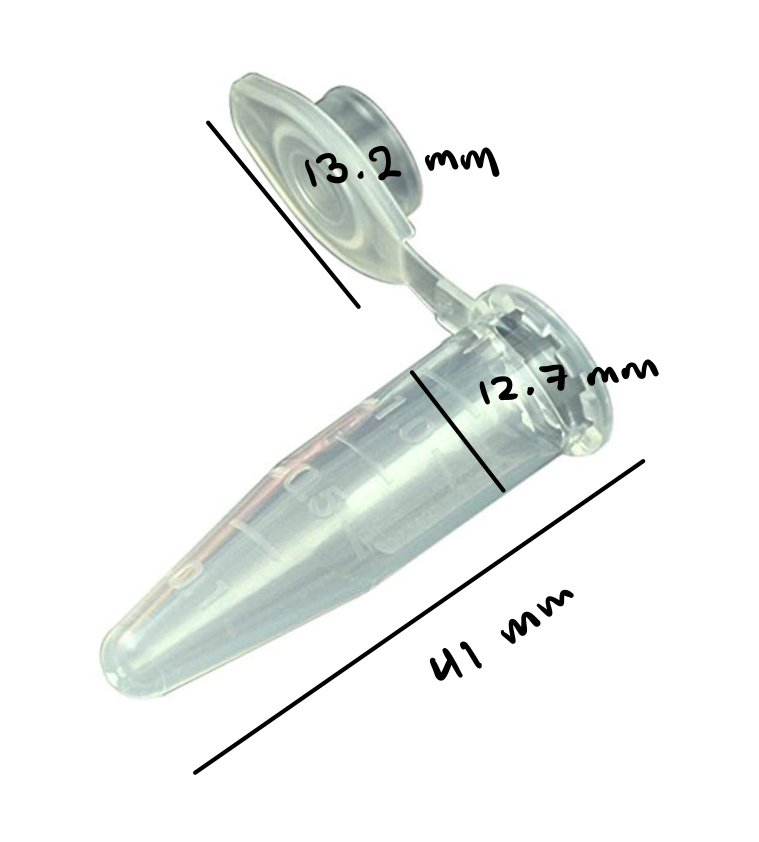

# diy centrifuge for DNA extraction

## things to buy
- [BLDC motor](https://www.amazon.com/Jrelecs-Upgrade-Waterproof-3000KV-Brushless/dp/B07F2Z99D1/)
- [LiPo Battery](https://www.amazon.com/HRB-50C-100C-Quadcopter-Helicopter-Airplane/dp/B06XNTHQRZ)

## LiPo batteries
- 1S = 3.7V
- 2S = 7.4V 
- **discharge rating (&ldquo;C&rdquo; rating).** the discharge rating describes the maximum number of amps that can be pushed from the battery

## quick links
- [D11C echo board with 10 pin JTAG programmer](http://academy.cba.mit.edu/classes/embedded_programming/D11C/hello.D11C.echo.png)

## images

## list of components

<table>
  <tr>
    <th>type of component</th>
    <th>component number</th>
    <th>notes</th>
  </tr>
  <tr>
    <td>
      <a href="">analog hall effect sensor</a>
    </td>
    <td><code>A1324LLHLT-T</code></td>
    <td>
      <ul>
        <li><a href="http://academy.cba.mit.edu/classes/input_devices/mag/hello.mag.D11C.png">hello hall effect sensor board</a></li>
        <li><a href="/ref/HallEffect_A1324-5-6-Datasheet.pdf">datasheet (from digikey)</a></li>
      </ul>
    </td>
  </tr>
  <tr>
    <td>
      ESC
    </td>
    <td>ESC headers</td>
    <td>
      <ul>
        using <code>CONN_03X2-PINHEAD-SMD</code> footprint
      </ul>
    </td>
  </tr>
  <tr>
    <td>
      OLED
    </td>
    <td><code>SSD1315</code></td>
    <td>
      <ul>
        <li><a href="https://gitlab.cba.mit.edu/classes/863.21/site/-/issues/62">ling dong's notes</a></li>
      </ul>
    </td>
  </tr>
</table>

### powering the final project
- 60A is sourced from LiPo batteries
- mini USB connectors

---

## TODO (12/10/2021)
- design board
  - design and mill D11C board 
- [x] test 3D print with holes for mounting motor
- [x] model and test 3D print of rotor
- OLED display with buttons (hardest)
    - mill board, test writing text

## CAD notes
- need to add hole for ESC wires to loop beneath divider of circuits and centrifuge interface

---

## build log

### rotor and dimensions
- [**1.5 mL Eppendorf tube**](https://www.amazon.com/Globe-Scientific-111558-Polypropylene-Microcentrifuge/dp/B00577ZQH8/)

### oled stuff

## questions
- potentiometer; no handle?
- where is 5V coming from in the [ESC demo board](http://academy.cba.mit.edu/classes/output_devices/ESC/hello.ESC.44.png) ([components(http://academy.cba.mit.edu/classes/output_devices/ESC/hello.ESC.44.jpg))?