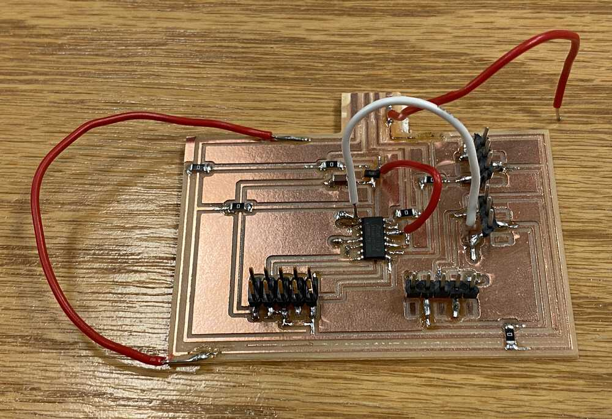
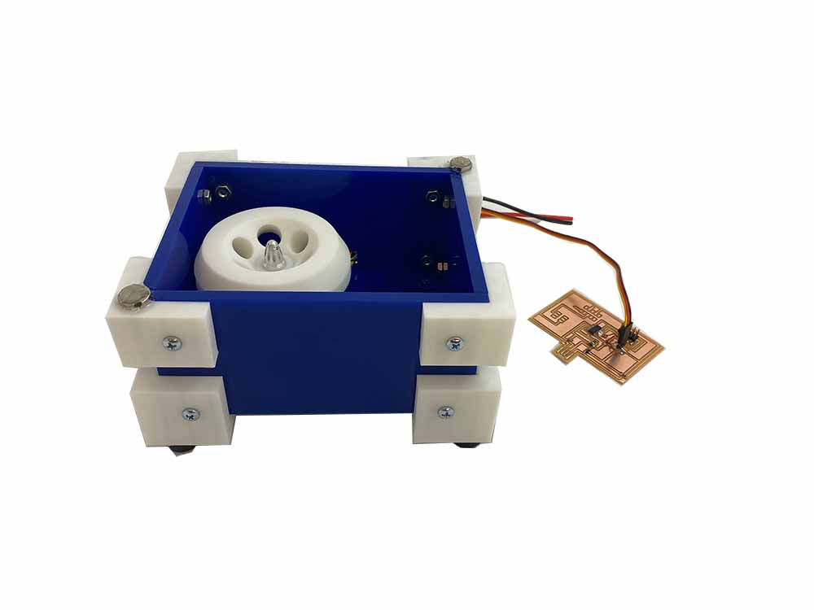

# diy centrifuge for DNA extraction

## bill of parts

|count|part|price|link/vendor|
|:----|:---|:---:|:---------:|
|168 sq in|acrylic casing|$0.05 per sq in|[home depot](https://www.homedepot.com/p/OPTIX-48-in-x-96-in-x-1-4-in-Clear-Acrylic-Sheet-MC-102/202038056)|
|1|bldc motor with esc|$22.88|[amazon](https://www.amazon.com/BGNing-Brushless-Outrunner-Controller-Quadcopter/dp/B00PXVG7VM)|
|16|8/32 3/4" screw and nut|||
|4|6/32 1/2" screw and nut|||
|2|magnets|$0.22 per magnet|[amazon](https://www.amazon.com/SMARTAKE-Refrigerator-Magnets-Multi-Use-Whiteboard/dp/B07D8QPG2Y)|

## build log

- <Link to="./notes">look here for notes that i took while building the project (e.g. measurements, reference pics, etc.)</Link>

### basic knowledge

- **batteries**
  - LiPo batteries typically listed as _1S_, _2S_, _3S_, etc. each `S` represents a battery cell, which corresponds to more voltage:
    - <C chem="\mathrm{1\ S} = \pu{3.7V}" />
    - <C chem="\mathrm{2\ S} = 2 \times \pu{3.7V} = \pu{7.4V}" />
  - LiPo batteries also have a **discharge rating (&ldquo;C&rdquo; rating).** the discharge rating describes the _maximum number of amps_ that can be safely pushed from the battery

### cad
- the centrifuge should be able to spin these [**1.5 mL Eppendorf tubes**](https://www.amazon.com/Globe-Scientific-111558-Polypropylene-Microcentrifuge/dp/B00577ZQH8/).

### board

- i had to mill the board _five times_ to complete the final project: what a time...
  - the first board i made was very tightly packed (even following the `fab.dru` design rules) and resulted in a board with weakly adhered traces. likely, i also weakened the traces during the soldering process; this resulted in me ripping the traces off when i tried to disconnect the JTAG programmer cable from the board
  - the second board had a major design oversight: somehow, i didn't realize that my USB header was flipped, and so the 5V and ground traces were flipped. this meant that as soon 
    - i tried to cut traces and wire jumpers, but because of the way i had laid out the board, this turned out to be pretty much impossible, and i opted to redesign the board.
  - the third board was correct, but the 1/64 endmill had become dull by the time i was milling, and broke during the milling process
  - the fourth board worked &mdash; annoyingly, i also ripped a trace off when i was trying to clean up the board of stray traces to prevent shorts, which made me have to remill the board
  - finally, i got a beautifully milled board (the z-height was still a little too low, making the traces almost engraved rather than a thin layer), that i soldered correctly without problems

### ESC motor

- **calibrating the ESC motor.** probably the most annoying yet also satisfying moments was getting the ESC motor calibrated and running.
  - the calibration protocol (standard for most ESCs, and was also described on the Amazon vendor's page)
    - power on with uC sending high pulses, wait until beeps
    - turn off
    - switch uC to send low pulses
    - turn on
    - wait for beeps
    - turn off
    - next time the motor is powered on, it will be calibrated
  - the first issue was sending the correct signal to the motor. at first i was thinking that the calibration protocol i was using was incorrect, but it turned out that wasn't it
    - in a streak of luck, i realized that the ESC probably wasn't even receiving the pulses i thought i had programmed the uC to send
    - debugging using the oscilloscope confirmed this; pin 5 that i was using to send the PWM signal to the ESC was not outputting high voltages.
    - after cutting traces, wiring jumps, and linking pin 16 to the ESC, the calibration protocol worked, and i was able to get the motor to run.
- i was also wondering where the power (5V) came from in the [ESC demo board](http://academy.cba.mit.edu/classes/output_devices/ESC/hello.ESC.44.png) ([components](http://academy.cba.mit.edu/classes/output_devices/ESC/hello.ESC.44.jpg)); i think it's not actually a used connection and that voltage comes from the external source that powers the motor.

### the case
- designing the case was the most interesting part of this week, since i hadn't done any integration in the previous weeks before
  - i was a little annoyed because i had designed a case in Fusion at home, but forgot to the save the project (i didn't lose the CAD, it just didn't upload to the cloud), and i had to re-CAD it when i got to campus
  - instead of re-CADing the whole thing though, i just remade the geometry of the faces, and exported them to DXF to be cut on the laser cutter
  - acrylic has very good tolerances with respect to kerf, and so the measurements that i 
- i actually made a mistake in the size of the mounting holes for the corner braces that would connect the acrylic sides together, but it was okay because we had bolts and nuts of a larger diameter that could fit into the holes
- 3d printing the corner braces actually took way too long, but i was very pleased with the results

## the end result

<iframe width="560" height="315" src="https://www.youtube.com/embed/PYBzR6Y6vOw" title="YouTube video player" frameborder="0" allow="accelerometer; autoplay; clipboard-write; encrypted-media; gyroscope; picture-in-picture" allowfullscreen></iframe>

## files
- case
  - [cover.dxf](/final/case/laser/cover.dxf)
  - [base.dxf](/final/case/laser/base.dxf)
  - [long-side-gap.dxf](/final/case/laser/long-side-gap.dxf)
  - [long-side.dxf](/final/case/laser/long-side.dxf)
  - [short-side.dxf](/final/case/laser/short-side.dxf)
  - [corner_brace.obj](/final/case/3d/corner_brace.obj)
  - [side_brace.obj](/final/case/3d/side_brace.obj)
- rotor
  - [rotor.obj](/final/case/3d/rotor.obj)
- code
  - [centrifuge.ino](/final/centrifuge.ino)
  - [interface.py](/final/interface.py)