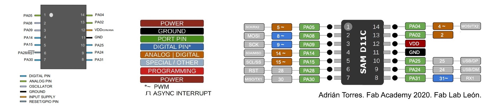

# diy centrifuge for DNA extraction

## bill of parts

|count|part|price|link/vendor|
|:----|:---|:---:|:---------:|
|168 sq in|acrylic casing|$0.05 per sq in|[home depot](https://www.homedepot.com/p/OPTIX-48-in-x-96-in-x-1-4-in-Clear-Acrylic-Sheet-MC-102/202038056)|
|1|bldc motor with esc|$22.88|[amazon](https://www.amazon.com/BGNing-Brushless-Outrunner-Controller-Quadcopter/dp/B00PXVG7VM)|
|16|8/32 3/4" screw and nut|||
|4|6/32 1/2" screw and nut|||
|2|magnets|$0.22 per magnet|[amazon](https://www.amazon.com/SMARTAKE-Refrigerator-Magnets-Multi-Use-Whiteboard/dp/B07D8QPG2Y)|

## quick links
- [D11C echo board with 10 pin JTAG programmer](http://academy.cba.mit.edu/classes/embedded_programming/D11C/hello.D11C.echo.png)
- [SnapEDA: finding footprints](https://www.snapeda.com/home/)

``` python
# create traces
display none
display top vias pads
export image

# create outline
display none
display bottom dimension vias
export image
```

## images

<div style="width: 400px; margin: 0 auto;">


</div>




## list of components

<table>
  <tr>
    <th>type of component</th>
    <th>component number</th>
    <th>notes</th>
  </tr>
  <tr>
    <td>
      <a href="">analog hall effect sensor</a>
    </td>
    <td><code>A1324LLHLT-T</code></td>
    <td>
      <ul>
        <li><a href="http://academy.cba.mit.edu/classes/input_devices/mag/hello.mag.D11C.png">neil's demo board for hall effect sensor</a></li>
        <li><a href="/ref/HallEffect_A1324-5-6-Datasheet.pdf">datasheet (from digikey)</a></li>
      </ul>
    </td>
  </tr>
  <tr>
    <td>
      ESC
    </td>
    <td>ESC headers</td>
    <td>
      <ul>
        <li>using <code>CONN_03X2-PINHEAD-SMD</code> footprint</li>
        <li><a href="http://academy.cba.mit.edu/classes/output_devices/ESC/hello.ESC.44.png">neil's demo board for ESC</a></li>
        <li>accepts 5V</li>
      </ul>
    </td>
  </tr>
  <tr>
    <td>
      OLED
    </td>
    <td><code>SSD1315</code></td>
    <td>
      <ul>
        <li><a href="https://gitlab.cba.mit.edu/classes/863.21/site/-/issues/62">ling dong's notes</a></li>
        <li>works with both 5V and 3.3V</li>
        <li><a href="http://academy.cba.mit.edu/classes/output_devices/OLED/hello.SSD1306.45.png">neil's demo board for the SSD1306</a></li>
      </ul>
    </td>
  </tr>
</table>

---

## todo schedule

### 12/10/2021
- [ ] design and mill D11C board 
- [x] test 3D print with holes for mounting motor
- [x] model and test 3D print of rotor
- OLED display with buttons (hardest)
    - [ ] mill board, test writing text

### 12/11/2021
- [x] finish designing board, mill
- [ ] remake hall effect breakout board with voltage divider on breakout board, not split

### 12/12/2021

---

## CAD notes
- need to add hole for ESC wires to loop beneath divider of circuits and centrifuge interface

---

## build log

### basic knowledge

- **batteries**
  - LiPo batteries typically listed as _1S_, _2S_, _3S_, etc. each `S` represents a battery cell, which corresponds to more voltage:
    - <C chem="\mathrm{1\ S} = \pu{3.7V}" />
    - <C chem="\mathrm{2\ S} = 2 \times \pu{3.7V} = \pu{7.4V}" />
  - LiPo batteries also have a **discharge rating (&ldquo;C&rdquo; rating).** the discharge rating describes the _maximum number of amps_ that can be safely pushed from the battery

### cad
- [**1.5 mL Eppendorf tube**](https://www.amazon.com/Globe-Scientific-111558-Polypropylene-Microcentrifuge/dp/B00577ZQH8/)

<div style="width: 300px; margin: 0 auto;">


</div>


### rotor and dimensions

### board

- I had to mill the board over 4 times to complete the final project: what a time...
  - the first board I made was very tightly packed (even following the `fab.dru` design rules) and resulted in a board with weakly adhered traces. likely, i also weakened the traces 
  - the second board
  - the third board was correct
  - the (second try) of the third board
  - the fourth board worked &mdash; annoyingly, i also ripped a trace off when i was trying to clean up the board of stray traces to prevent shorts, which made me have to remill the board

- **pinout**
  - ESC
    - PA14 <RA /> ESC PWM signal
  - A1324 (Hall Effect)
    - PA02 <RA /> Hall effect output voltage

### ESC motor

**calibrating the ESC motor.** probably the most annoying yet also satisfying moments was getting the ESC motor calibrated and running.

- calibration didn't work because pin 5 wasn't working
- power on with high pulses, wait until beeps
- turn off
- switch to low pulses
- turn on
- wait for beeps
- turn off
- turn on
- set to speed less than high
- for some reason, 

i was also wondering where the power (5V) came from in the [ESC demo board](http://academy.cba.mit.edu/classes/output_devices/ESC/hello.ESC.44.png) ([components](http://academy.cba.mit.edu/classes/output_devices/ESC/hello.ESC.44.jpg)); i think it's not actually a used connection and that voltage comes from the external source that powers the motor.

---

## questions
- potentiometer; no handle?