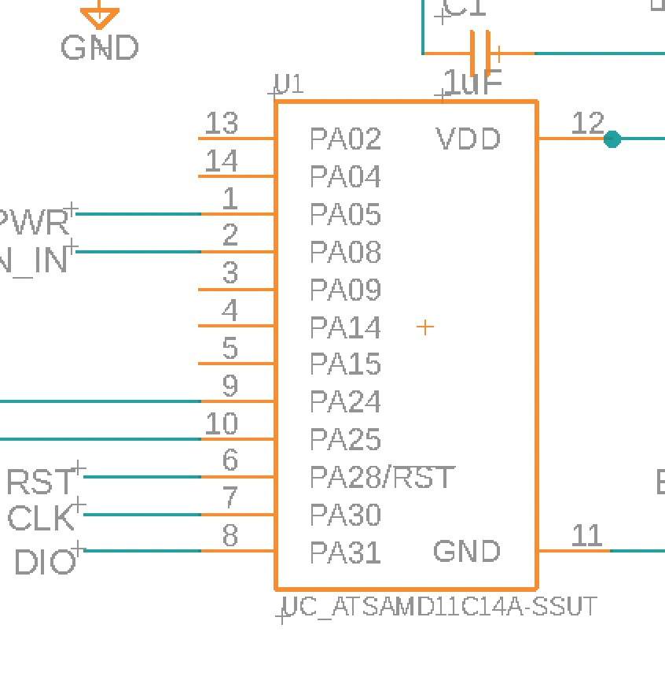
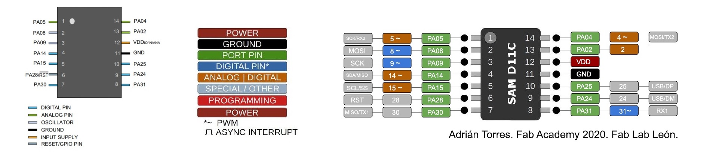

# build notes

## quick links
- [D11C echo board with 10 pin JTAG programmer](http://academy.cba.mit.edu/classes/embedded_programming/D11C/hello.D11C.echo.png)
- [SnapEDA: finding footprints](https://www.snapeda.com/home/)

``` python
# create traces
display none
display top vias pads
export image

# create outline
display none
display bottom dimension vias
export image
```

## images

<div style="width: 400px; margin: 0 auto;">



</div>



## list of components

<table>
  <tr>
    <th>type of component</th>
    <th>component number</th>
    <th>notes</th>
  </tr>
  <tr>
    <td>
      <a href="">analog hall effect sensor</a>
    </td>
    <td><code>A1324LLHLT-T</code></td>
    <td>
      <ul>
        <li><a href="http://academy.cba.mit.edu/classes/input_devices/mag/hello.mag.D11C.png">neil's demo board for hall effect sensor</a></li>
        <li><a href="/ref/HallEffect_A1324-5-6-Datasheet.pdf">datasheet (from digikey)</a></li>
      </ul>
    </td>
  </tr>
  <tr>
    <td>
      ESC
    </td>
    <td>ESC headers</td>
    <td>
      <ul>
        <li>using <code>CONN_03X2-PINHEAD-SMD</code> footprint</li>
        <li><a href="http://academy.cba.mit.edu/classes/output_devices/ESC/hello.ESC.44.png">neil's demo board for ESC</a></li>
        <li>accepts 5V</li>
      </ul>
    </td>
  </tr>
  <tr>
    <td>
      OLED
    </td>
    <td><code>SSD1315</code></td>
    <td>
      <ul>
        <li><a href="https://gitlab.cba.mit.edu/classes/863.21/site/-/issues/62">ling dong's notes</a></li>
        <li>works with both 5V and 3.3V</li>
        <li><a href="http://academy.cba.mit.edu/classes/output_devices/OLED/hello.SSD1306.45.png">neil's demo board for the SSD1306</a></li>
      </ul>
    </td>
  </tr>
</table>

---

## todo schedule

### 12/10/2021
- [ ] design and mill D11C board 
- [x] test 3D print with holes for mounting motor
- [x] model and test 3D print of rotor
- OLED display with buttons (hardest)
    - [ ] mill board, test writing text

### 12/11/2021
- [x] finish designing board, mill
- [ ] remake hall effect breakout board with voltage divider on breakout board, not split

### 12/12/2021
- [x] build case

## electronics notes

- **pinout**
  - ESC
    - PA14 <RA /> ESC PWM signal
  - A1324 (Hall Effect)
    - PA02 <RA /> Hall effect output voltage

## CAD notes
- need to add hole for ESC wires to loop beneath divider of circuits and centrifuge interface