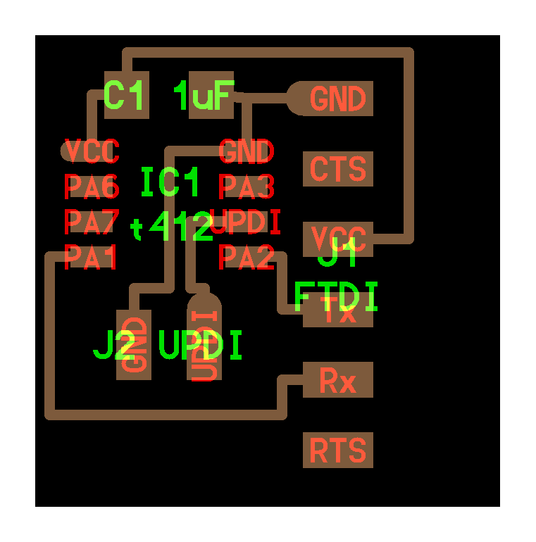

# rec 4: electronics production

- good tutorial: [getting to blinky 5.0](https://contextualelectronics.com/courses/getting-to-blinky-5-0/)
- another tutorial with eagle: [making PCBs with EAGLE (Adafruit)](https://learn.adafruit.com/making-pcbs-with-oshpark-and-eagle/layers)

## keyboard shortcuts
- A: add component
- C: copy component
- E: edit text (component name, resistor value, etc.)
- L: create label
- M: move component
- R: rotate component
- W: draw wire
- X: flip component

## component names
- gnd
- ftdi (serial header)

## kicad parts
- Schematic Editor: this is where you make schematics
- Symbol Editor: this is where you can import symbol libraries
- PCB Editor: third button, where you create the layout

## annotating (assigning references)
- symbol left of the bug (design rules checker)

## checking for mistakes
- **Design Rules Checker ("bug symbol")**

## getting footprints
- symbol right of the bug
- [footprints are in .pretty folders](https://kicad.github.io/footprints/)

## netlist
- generate use button with NET on it
- schematic -> netlist -> layout

## pcb layout
- setup basic trace widths: `file / board setup / net classes`
- need to connect the "rats nest" with actual wires
- labels are part of **silk screen** (white text that will be the labels when sent to a board manufacturing house)
- X: create trace in Layout editor

## getting ready to mill (mods)
- make two layers: `cu` (copper) and `outline`
- `outline` should be black background, white inside

## notes
- **R vs. R?**
    - R? (top) is the reference name
    - R (bottom) is the resistance value

## sizes of "passives"
- 1206 (120 mil x 60 mil)
    - can put **two wires** under it
- 0805 (80 mil x 50 mil)
- 0603

## terms
- **push and shove routing (EAGLE).**
- **DRC (EAGLE).** design rule check
- [**copper (polygon) pour**](https://en.wikipedia.org/wiki/Copper_pour). used for dissipating heat