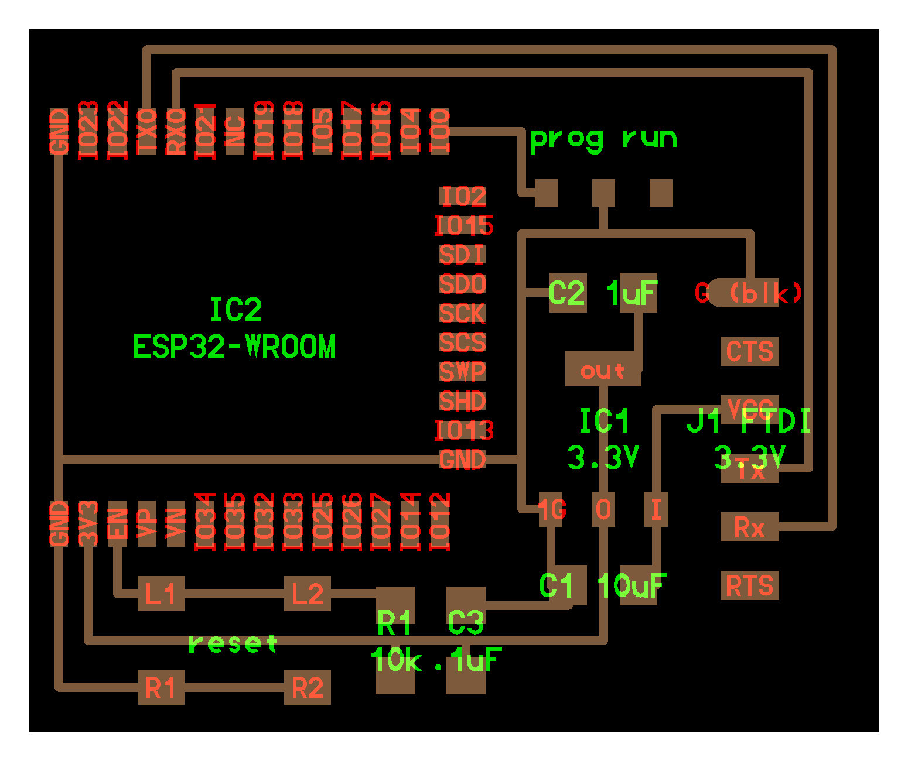

# week 10: networking and communications

- for this week, i planned to create a board that would upload sensor data to a database via a web api



```c
//
// hello.ESP32-WROOM.WebServer.ino
//
// ESP32 Web server hello-world
//
// Neil Gershenfeld 11/12/19
//
// This work may be reproduced, modified, distributed,
// performed, and displayed for any purpose, but must
// acknowledge this project. Copyright is retained and
// must be preserved. The work is provided as is; no
// warranty is provided, and users accept all liability.
//

#include <WiFi.h>

const char* ssid = "your SSID goes here";
const char* password = "your password goes here";
WiFiServer server(80);

void setup() {
  Serial.begin(115200);
  printf("\nConnecting ");
  WiFi.begin(ssid,password);
  while (WiFi.status() != WL_CONNECTED) {
    delay(100);
    printf(".");
  }
  printf("\nConnected with address %s\n",WiFi.localIP().toString().c_str());
  server.begin();
}

void loop() {
  char cold,cnew;
  WiFiClient client = server.available();
  if (client) {
    printf("\nReceived connection from %s\n\n",client.remoteIP().toString().c_str());
    while (client.connected()) {
      if (client.available()) {
        cnew = client.read();
        printf("%c",cnew);
        if ((cold == '\n') && (cnew == '\r')) { // check for blank line at end of request
          client.printf("HTTP/1.1 200 OK\n");
          client.printf("Content-type:text/html\n");
          client.printf("\n");
          client.printf("Hello %s from ESP32-WROOM!<br>\n",client.remoteIP().toString().c_str());
          client.stop();
          break;
        }
        cold = cnew;
      }
    }
  }
}
```
