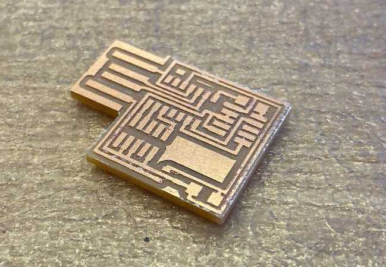
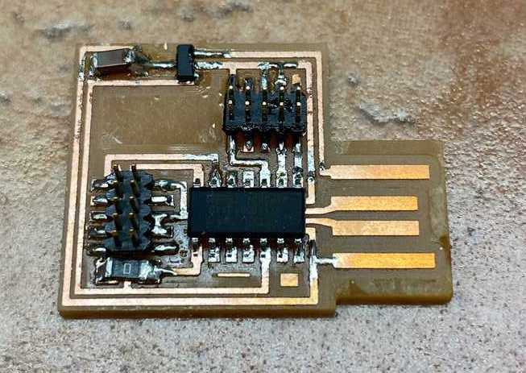
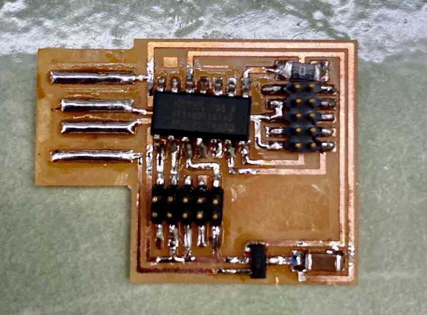

# week 2: electronics production

## things to remember
- **mods can't seem to talk to the machine?** turn the machine on
- **mods can't seem to talk to the machine?** make sure the mods server is running
- deburring by using the back of tweezers or spackle knife
- tilted components is okay, but not if contact isn't being made
- soldering temperature: **750 F**
- heat gun temperature: **270 to 330 F**
- can't use a voltmeter to measure shorts on a stuffed PCB because signals can pass through components
- you need to power both sides of the board (can't program an unpowered board)

## milling board
- (x, y, z) = (40, 20, 10)
- push the endmill every so slightly down when zeroing to ensure that it will cut through the copper

## the components
- 0.1A 3.3V regulator
- 1uF capacitor
- [ATSAMD11C microcontroller (datasheet)](http://ww1.microchip.com/downloads/en/devicedoc/atmel-42363-sam-d11_datasheet.pdf)
  - SAMD11
  - SAM = &ldquo;Smart ARM-based Microcontroller&rdquo;
- 0 Ohm resistor
- 2 8-pin headers

## general notes for the week
- milling the boards using the Roland SRM-20 is super fun

  <video width="600" controls>
    <source src="../videos/wk2/1a_milling.mp4" type="video/mp4" />
    Your browser does not support the video tag.
  </video>

  <video width="600" controls>
    <source src="../videos/wk2/1b_milling.mp4" type="video/mp4" />
    Your browser does not support the video tag.
  </video>

- we can still see the burrs on the bottom of the board: burrs often look like dirty parts of the board.

- most painful part of the week: soldering the microcontroller one pin off
- removing the component with a heat gun is surprisingly easy
- using the solder wick to remove the solder after removing the component in order to clean the surfaces
- using a thinner tip works better for me

## final product

## relation between &ldquo;CMSIS-DAP.10.D11C&rdquo; and arduino
- Arduino Nano uses an older MCU: ATmega328
- SAMD11 can handle USB using its internal clock; Arduino Nano needs another chip to translate serial to the ATmega
- Arduino Nano uses crystals (XTALs)
- otherwise very similar