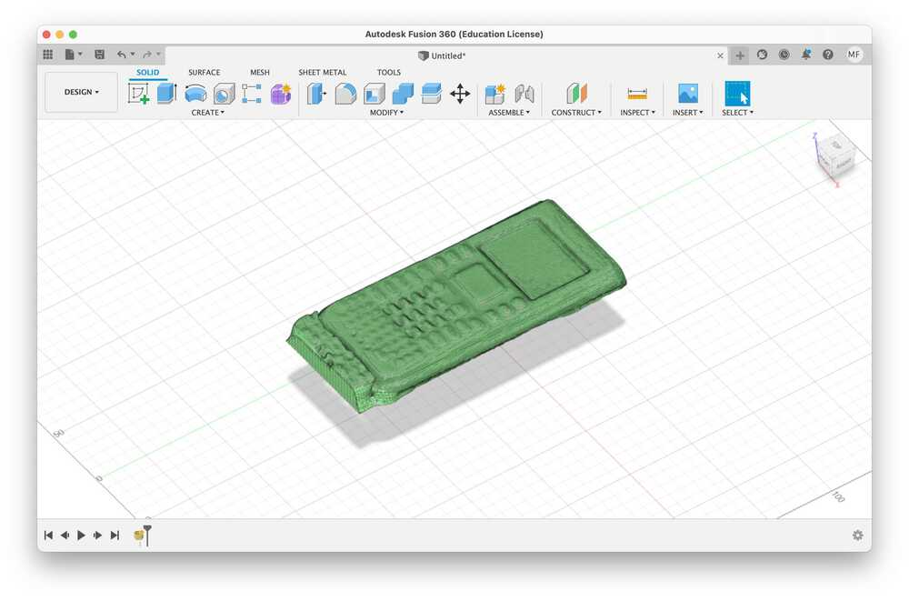
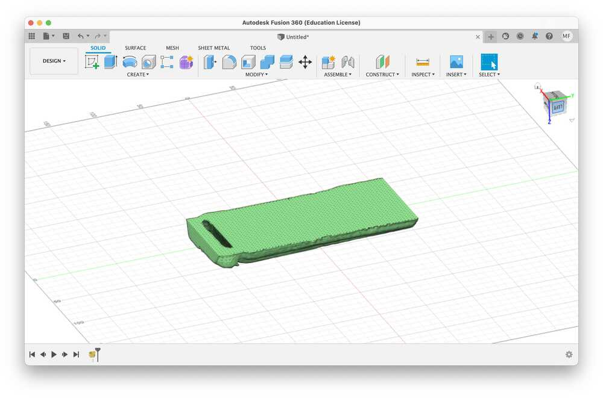

# week 3: 3d printing and scanning

## design rules: characterizing the 3d printer(s)
- two kinds of 3d printers
    - Sindoh
    - Prusa
- supports
    - overhang
        - ?
    - clearance
- unsupported
    - angle
    - overhang
    - bridging
- wall thickness
- dimensions
- anisotropy
- surface finish
- infill
- angles

## 3d printing: something that can't be made subtractively

## 3d scanning: a very finicky process

## files
- 3d scanned calculator (.obj and .mtl): [3dscan-calculator.zip](/public/3dscan-calculator.zip)
- testing the 3d printing: [intertwined_base.obj](/public/intertwined_base.obj)
- intertwined cubes: [intertwined_small.obj](/public/intertwined_small.obj)