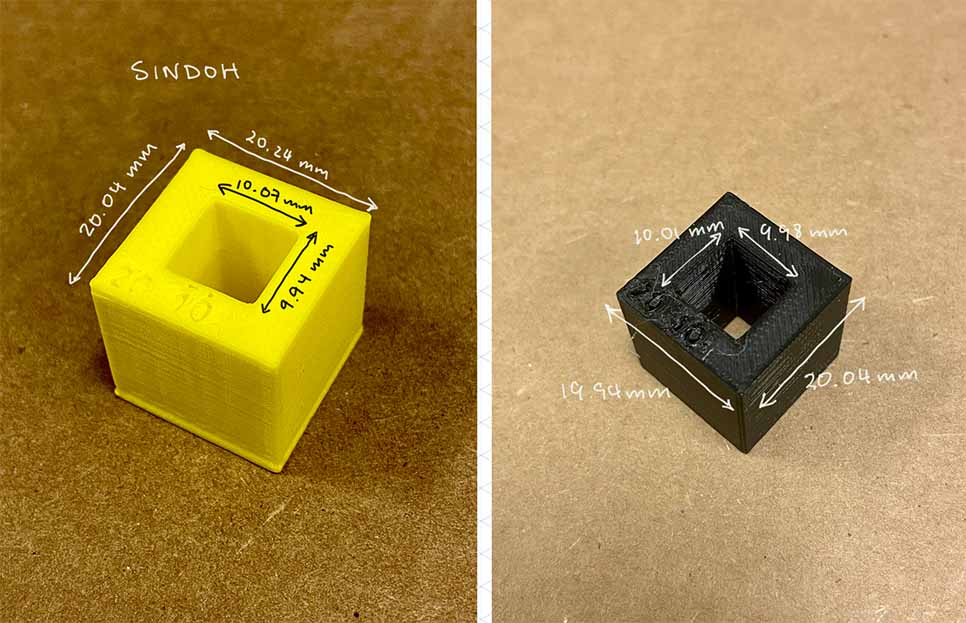
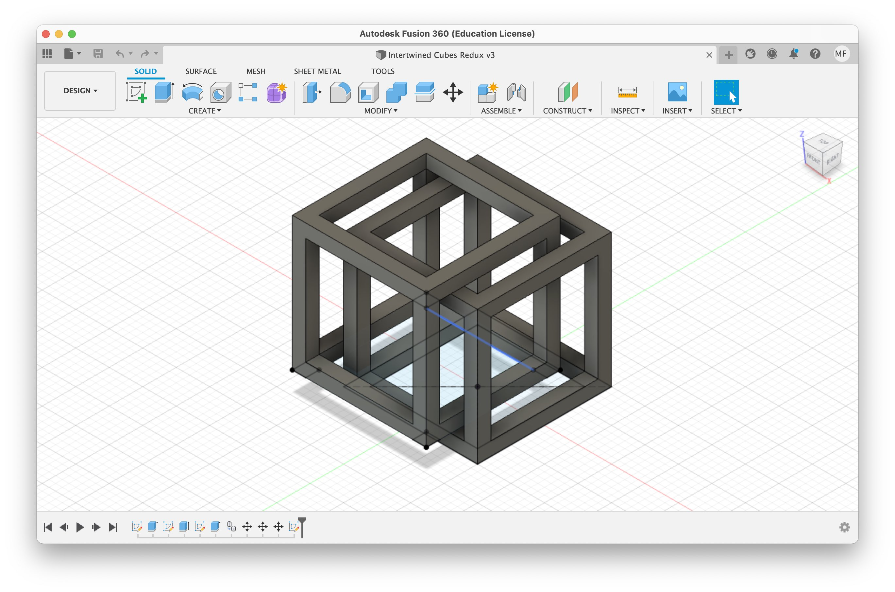
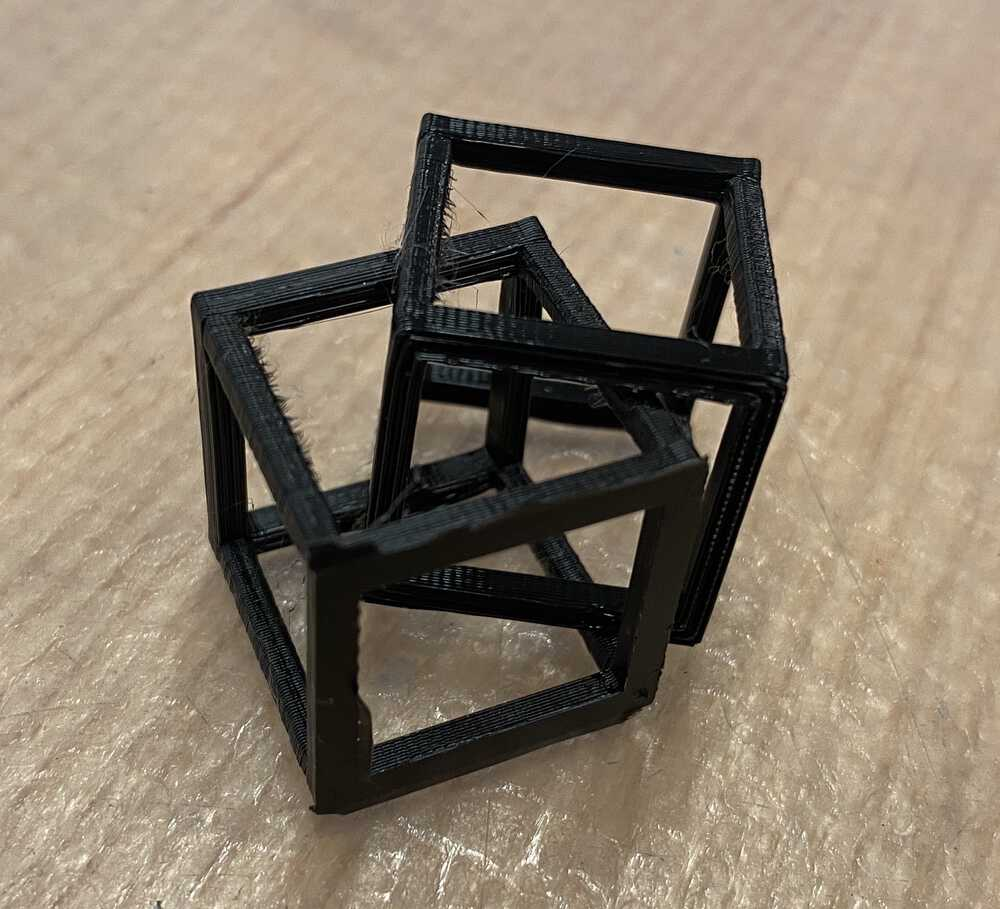
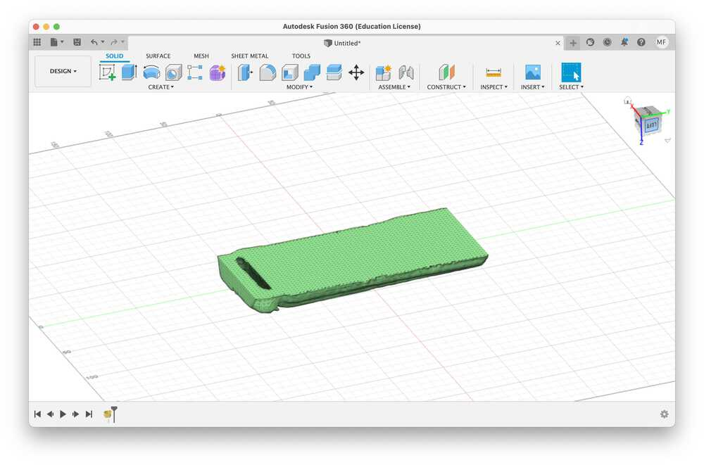
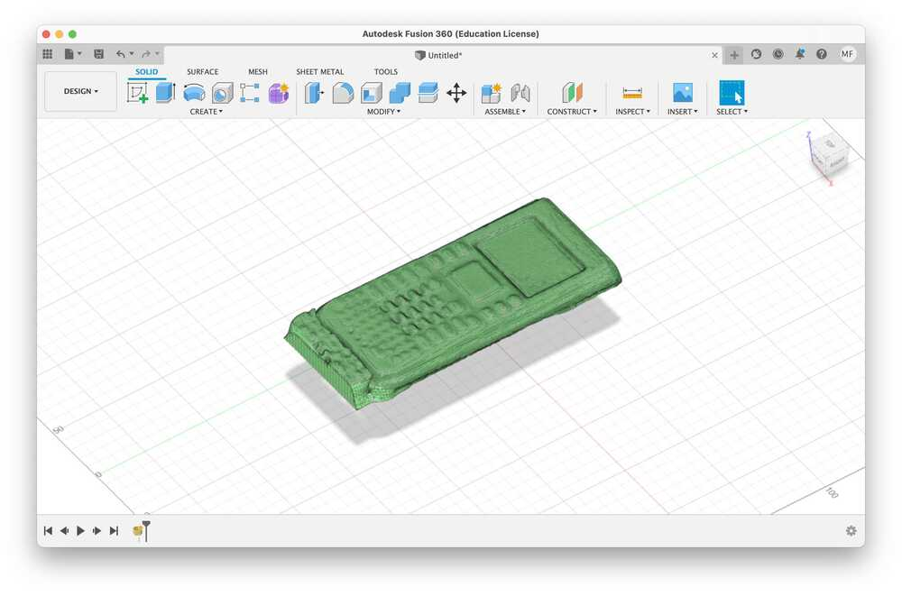

# week 3: 3d printing and scanning

## things to remember
- `.obj` files often come with a `.mtl` file
    - `.obj` files describe a mesh
    - `.mtl` files describe the materials in the mesh
- **export as `.obj` in Fusion.** `Right click (the body) / Save as mesh` (not `Export`)
- slice (a.k.a print) at **0.2mm QUALITY**; the output of PrusaSlic3r is `.gcode`, which is read by the 3d printer

## design rules: characterizing the 3d printer(s)
- two kinds of 3d printers
    - sindoh (yellow)
    - prusa (black)

### sindoh
- supports
    - overhang
    - clearance
        - 0.3 mm needed for clearance
- unsupported
    - angle
        - 20º angle
    - overhang
        - 2 mm
    - bridging
        - 20 mm bridges
- wall thickness
- dimensions (see image below)
- anisotropy
- surface finish
- infill
- angles

### prusa
- supports
    - overhang
    - clearance
        - 0.3 mm needed for clearance
- unsupported
    - angle
        - 20º angle
    - overhang
        - 3 mm
    - bridging
        - 20 mm bridges
- wall thickness
- dimensions (see image below)
- anisotropy
    - very anisotropic
- surface finish
    - pretty smooth (how do I quantify this?)
- infill
    - 15% is quite sturdy
- angles

## 3d printing: something that can't be made subtractively
- I originally designed the supports as well, but I couldn't figure out how to let PrusaSlic3r know that they were supports and not part of the model
- PrusaSlic3r reads `.stl` and `.obj` files, not `.step` files (at least according to the list of valid file formats to import)

- the prints adhere pretty strongly to the smooth bed; need to try the rough bed
- removing the support material was rather unnerving but surprisingly easy (as long as you take your time)
- the `X` button on the Prusa is not a clean cancel button; it is a "kill power" button
- 3d printing anything thicker than a couple of cm is slow (>2 hours)

## 3d scanning: a very finicky process
- i used the 3Dsense to scan my graphing calculator (TI Nspire) as it was one of the few objects with a matte enough finish for the scanner to recognize it
- the scanner is very sensitive to movement; moving too quickly around the object often causes it to lose tracking
    - this also means that most of the time it's impossible to scan whole object (from all directions) because any deviation from its tracking points causes the 3dsense to stop scanning
- you also can't fully scan flat objects (e.g. the calculator); the back is impossible to capture

## files
- 3d scanned calculator (.obj and .mtl): [3dscan-calculator.zip](/3dscan-calculator.zip)
- testing the 3d printing: [intertwined_base.obj](/intertwined_base.obj)
- intertwined cubes: [intertwined_small.obj](/intertwined_small.obj)