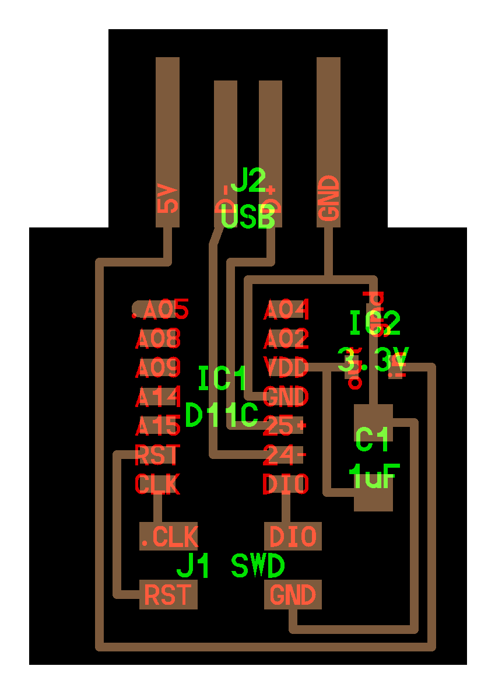

# week 4: electronics design

## board

## three js
- accessing dom element from threejs: `renderer.domElement` ([source](https://archive.is/LXTjL))
- amazing ThreeJS tutorials: [ThreeJS Fundamentals](https://threejsfundamentals.org/threejs/lessons/threejs-fundamentals.html)

## kicad basics

## learn more
- https://en.wikipedia.org/wiki/Procedural_modeling
- https://en.wikipedia.org/wiki/Constructive_solid_geometry

## making your own symbol

### symbol editor
- https://en.wikipedia.org/wiki/Reference_designator#Designators

### footprint editor

## usb
- [D+ and D- (data positive and data negative)](https://en.wikipedia.org/wiki/Differential_signalling)

## graphics
- [**phong shading**](https://en.wikipedia.org/wiki/Phong_shading). `MeshPhongMaterial`

## from eagle to mods ([source: Jake Read](https://archive.is/m0iyF))
- exporting PNGs that are appropriate for manufacturing using mods in a fab lab is a bit of a trick. We need to get PNGs that are purely black and white, that contain only the layers we want to mill.
- To export a PNG for the traces, use these commands:
    - `display none` (make all of the layers invisible)
    - `display top vias pads` (display top copper layers)
    - `export image`
        - export a PNG, use an appropriate DPI (1000 is likely high enough) and use the monochrome option
- To export a PNG for the outline, we do something similar:
    - `display none`
    - `display bottom dimension vias`
    - `export image`
        - the same, monochrome, with the same DPI

- [proactive DRC ("property change failed")](https://forums.autodesk.com/t5/fusion-360-electronics/property-change-failed-a-k-a-proactive-drc/td-p/9682405)