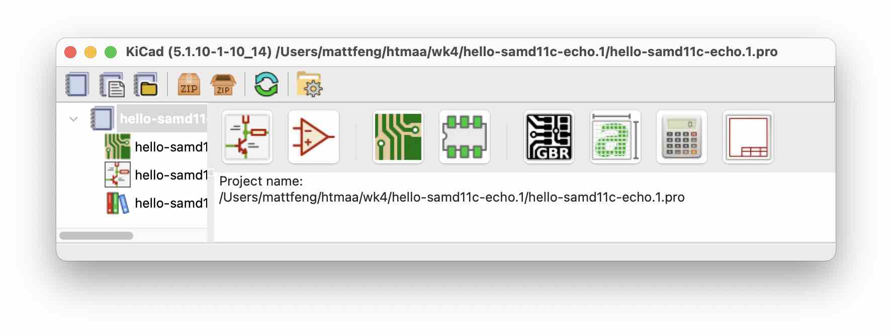

# week 4: electronics design

- https://stackoverflow.com/questions/26524684/how-to-assign-a-id-to-canvas-in-the-three-js-application
- https://threejs.org/docs/index.html#manual/en/introduction/Creating-a-scene
- amazing ThreeJS tutorials: [ThreeJS Fundamentals](https://threejsfundamentals.org/threejs/lessons/threejs-fundamentals.html)

## kicad basics

## learn more
- https://en.wikipedia.org/wiki/Procedural_modeling
- https://en.wikipedia.org/wiki/Constructive_solid_geometry

## making your own symbol

### symbol editor
- https://en.wikipedia.org/wiki/Reference_designator#Designators

### footprint editor

## usb
- [D+ and D- (data positive and data negative)](https://en.wikipedia.org/wiki/Differential_signalling)

## graphics
- [**phong shading**](https://en.wikipedia.org/wiki/Phong_shading). `MeshPhongMaterial`