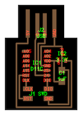
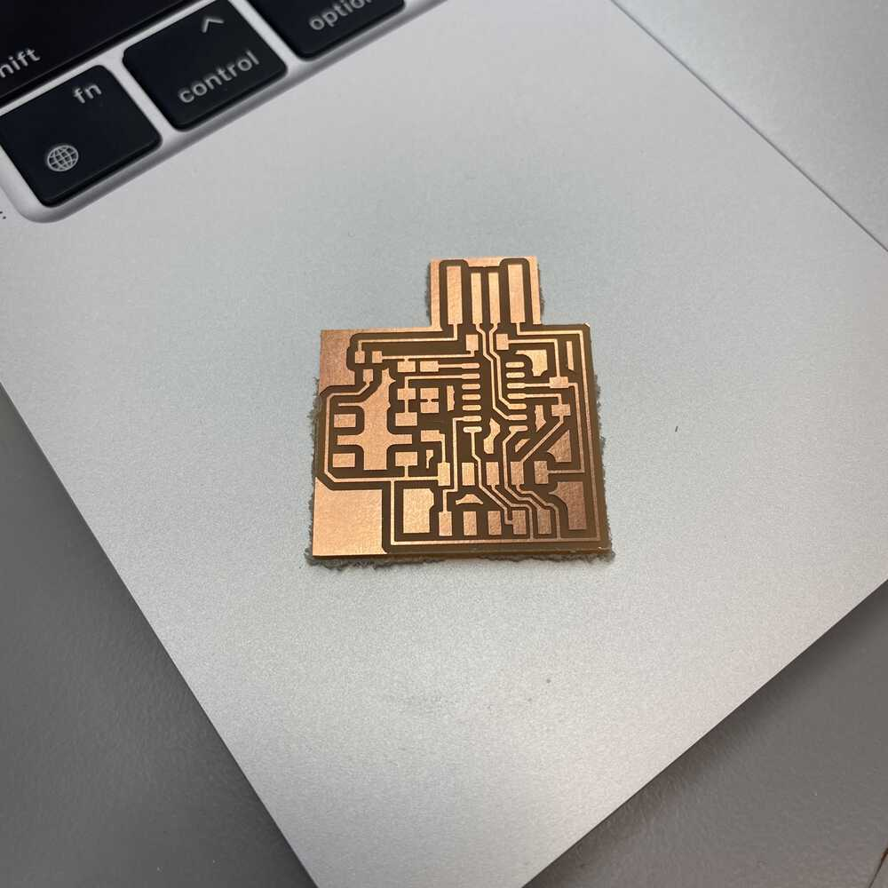
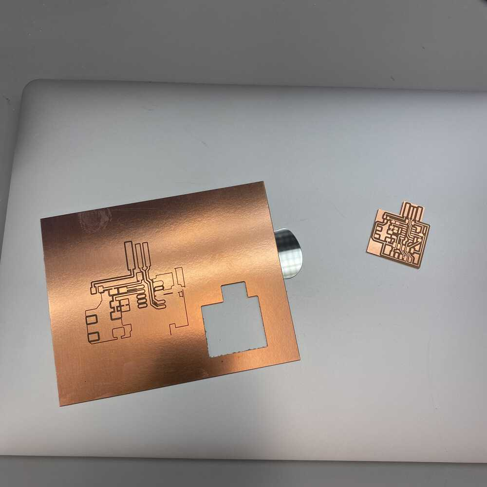
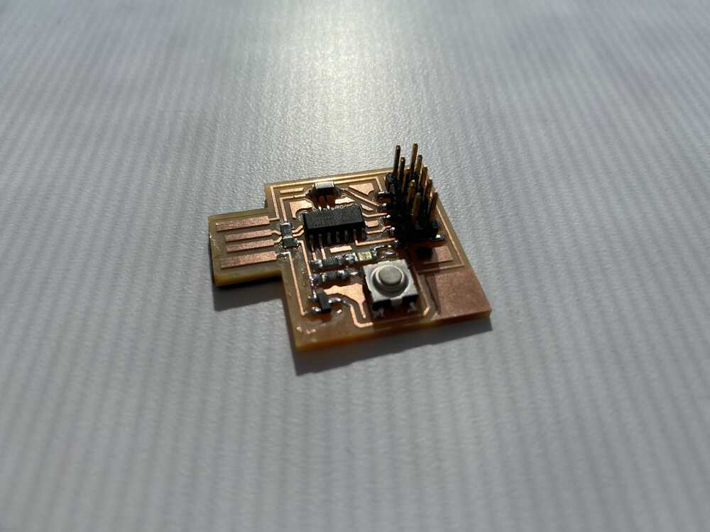

# week 4: electronics design

## board we are making


## three js
- accessing dom element from threejs: `renderer.domElement` ([source](https://archive.is/LXTjL))
- amazing ThreeJS tutorials: [ThreeJS Fundamentals](https://threejsfundamentals.org/threejs/lessons/threejs-fundamentals.html)

## kicad basics


## making your own symbol

### symbol editor
- https://en.wikipedia.org/wiki/Reference_designator#Designators

### footprint editor

## usb
- [D+ and D- (data positive and data negative)](https://en.wikipedia.org/wiki/Differential_signalling)

## graphics
- [**phong shading**](https://en.wikipedia.org/wiki/Phong_shading). `MeshPhongMaterial`

## from eagle to mods ([source: Jake Read](https://archive.is/m0iyF))
- exporting PNGs that are appropriate for manufacturing using mods in a fab lab is a bit of a trick. We need to get PNGs that are purely black and white, that contain only the layers we want to mill.
- To export a PNG for the traces, use these commands:
    - `display none` (make all of the layers invisible)
    - `display top vias pads` (display top copper layers)
    - `export image`
        - export a PNG, use an appropriate DPI (1000 is likely high enough) and use the monochrome option
- To export a PNG for the outline, we do something similar:
    - `display none`
    - `display bottom dimension vias`
    - `export image`
        - the same, monochrome, with the same DPI

## samd development using arduino
- arduino pins: [DO NOT FOLLOW the pinout from this link](https://oshwlab.com/wagiminator/samd11c-development-board)
- [most important website for programming SAMD chip with arduino](http://fabacademy.org/2020/labs/leon/students/adrian-torres/samdino.html)
    - [another useful guide](https://fabacademy.org/2020/labs/ulb/students/quentin-bolsee/projects/samd11c_uart-updi/)

### programming the board
- `brew install lsusb`. make sure that your programmer is recognized by the computer
- [running EDBG](https://gitlab.cba.mit.edu/classes/863.21/site/-/issues/22)
    - wasn't working on macOS
- download the bootloader from [embedded programming week](http://academy.cba.mit.edu/classes/embedded_programming/index.html) (search &ldquo;bootloader&rdquo; and click the link)

## blink

```c
// hello.D11C.blink.ino
//
// SAMD11C LED blink hello-world
//
// Neil Gershenfeld 11/29/19
//
// This work may be reproduced, modified, distributed,
// performed, and displayed for any purpose. Copyright is
// retained and must be preserved. The work is provided
// as is; no warranty is provided, and users accept all 
// liability.

#define LED (1 << 5) // define LED pin

void setup() {
  SYSCTRL->OSC8M.bit.PRESC = 0; // set OSC8M clock prescaler to 1
  REG_PORT_DIR0 |= LED; // set LED pin to output
}

void loop() {
  REG_PORT_OUT0 |= LED; // turn on LED
  delay(100); // delay
  REG_PORT_OUT0 &= ~LED; // turn off LED
  delay(100); // delay
}
```

## [echo](http://academy.cba.mit.edu/classes/embedded_programming/t412/hello.t412.echo.ino)

```c
// hello.t412.echo.ino
//
// tiny412 echo hello-world
//    115200 baud
//
// Neil Gershenfeld 12/8/19
//
// This work may be reproduced, modified, distributed,
// performed, and displayed for any purpose, but must
// acknowledge this project. Copyright is retained and
// must be preserved. The work is provided as is; no
// warranty is provided, and users accept all liability.

#define max_buffer 25

static int index = 0;
static char chr;
static char buffer[max_buffer] = {0};

void setup() {
  Serial.begin(115200);
}

void loop() {
  if (Serial.available() > 0) {
    chr = Serial.read();
    Serial.print("hello.t412.echo: you typed \"");
    buffer[index++] = chr;
    if (index == (max_buffer-1))
      index = 0;
    Serial.print(buffer);
    Serial.println("\"");
  }
}
```

## characterizing the board using test instruments

<p align="center">
  <video width="600" controls>
    <source src="../videos/wk4/characterization.mp4" type="video/mp4" />
    Your browser does not support the video tag.
  </video>
</p>

- we can actually see the power being turned on and off on the LED line, at the rate described by the code (100ms on, 100ms off)
- oscilloscopes should (often) measure with respect to ground

## week log

- milling complete: the Roland with mods gives markedly better results than the Othermill



- DPI export issue on macOS showed up; unfortunately i only caught it after i started milling...



- final board finished without needing to resolder! this week i used ~8 layers of vinyl to buff the thickness of the USB header



<p align="center">
  <video width="600" controls>
    <source src="../videos/wk4/blink.mp4" type="video/mp4" />
    Your browser does not support the video tag.
  </video>

  <video width="600" controls>
    <source src="../videos/wk4/echo.mp4" type="video/mp4" />
    Your browser does not support the video tag.
  </video>
</p>

## gatsby

- can't use three.js because it's a client side library... still need to figure out how to make server-side rendering skip it

```javascript
if (typeof window === "undefined" || !window.document) {
    console.log(`bailing out because of SSR`)
    return
}
```

## some issues this week and how to resolve them
- [proactive DRC ("property change failed")](https://forums.autodesk.com/t5/fusion-360-electronics/property-change-failed-a-k-a-proactive-drc/td-p/9682405)


## files
- board outline
    - w/o margin: [led_btn_board_orig_outline.png](/wk4/margin/led_btn_board_orig_outline.png)
    - w/ margin: [led_btn_board_margin_outline.png](/wk4/margin/led_btn_board_margin_outline.png)
- board traces
    - w/o margin: [led_btn_board_orig_traces.png](/wk4/nomargin/led_btn_board_orig_traces.png)
    - w/ margin: [led_btn_board_margin_traces.png](/wk4/margin/led_btn_board_margin_traces.png)
- script to add margins programmatically: [add_margin.py](/wk4/add_margin.py)
- samdino [basic_echo.ino](/wk4/samdino/basic_echo.ino)