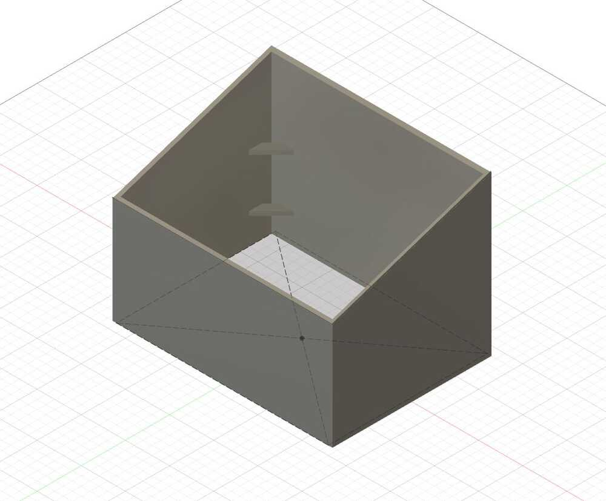

# week 5: computer-controlled machining

## cool software
- [LuBan](https://www.luban3d.com/)

## progress log
- i recently got into growing vegetables, but the problem is that i'm starting quite late; the first frost in cambridge is coming much sooner than is optimal for my plants
- a solution to this problem is a **cold frame**, essentially a glorified box with a transparent cover that lets light in and captures heat (e.g. glass, lexan, or acrylic)

- because the material we're provided is OSB, which isn't the best looking, and the kind of OSB we have has a weather-resistant layer, i figured this would be a perfect opportunity to build a cold frame!
- i designed the frame in Fusion 360. the frame has dimensions of 2' by 1.5' by 1.5', which is a lot of space. in retrospect, however, i could have made the frame larger, because i only ended using a single 4' by 4' OSB board

- milling the box was the most nerve-wracking part of the process: even though the design looked fine, there's no real guarantee that the milled product will fit together properly
- we used a trick to mill the 3/8" parts first; this let us locate (without manually driving the mill around) where the small joint connector pieces were located, so we could secure them to the spoilboard
- a vacuum base actually seems pretty desirable; the composite nails we used to secure the board to the spoilboard aren't easily removed from the final product, which is fine in my case (because the cold frame doesn't need to be aesthetic), but would be problematic if making nice furniture or the like.
- after an hour of milling, it took another 2 hours to sand down the edges of the frame (using a rasp, saw, and file); my eyes could only see the OSB strands for a while after that
- finally, however, i got to assemble the product! it's pretty sturdy, but press-fitting the final side board was a pain, because the other boards could still shift around slightly... i definitely need to study more joinery

- the frame still isn't complete; i have a piece of lexan coming in on thursday (oct 21, 2021), which will need to be drilled and secured with a hinge to the back board
- i also will probably cut a hole in the back board and run some grow lights on the inside, and possibly some heating elements as well; this would make the cold frame very useful in the winter

  <video width="600" controls>
    <source src="../videos/wk5/final_product.mp4" type="video/mp4" />
    Your browser does not support the video tag.
  </video>

## files
- cold frame fusion 360 cad model: [cold_frame.f3d](/wk5/cold_frame.f3d)