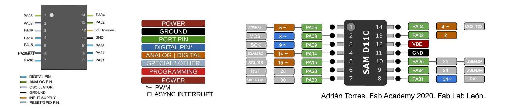

# week 6: embedded programming

## weekly log

- this week's assignment was to program our board
- i made mine light the LED when the button was clicked

```c
// click_led.ino

const int LED_PIN = 5;
const int BUTTON_PIN = 8;

int button_read = 0;

void setup() {
  Serial.begin(1152000);

  // setup pin modes
  pinMode(LED_PIN, OUTPUT);
  pinMode(BUTTON_PIN, INPUT);
}

void loop() {
  button_read = 1 - digitalRead(BUTTON_PIN);
  Serial.println(button_read);

  digitalWrite(LED_PIN, button_read);
}
```

- just for future reference, here are the settings i used to upload the code to my board

<p>
  <video width="600" controls>
    <source src="../videos/wk6/config_options.mp4" type="video/mp4" />
    Your browser does not support the video tag.
  </video>
</p>

- i had to make sure i was using the right pinout, which i've provided below



- the final product!

<p align="center">
  <video width="600" controls>
    <source src="../videos/wk6/button_led.mp4" type="video/mp4" />
    Your browser does not support the video tag.
  </video>
</p>

## files
- code for led and button: [click_led.ino](/wk6/click_led.ino)