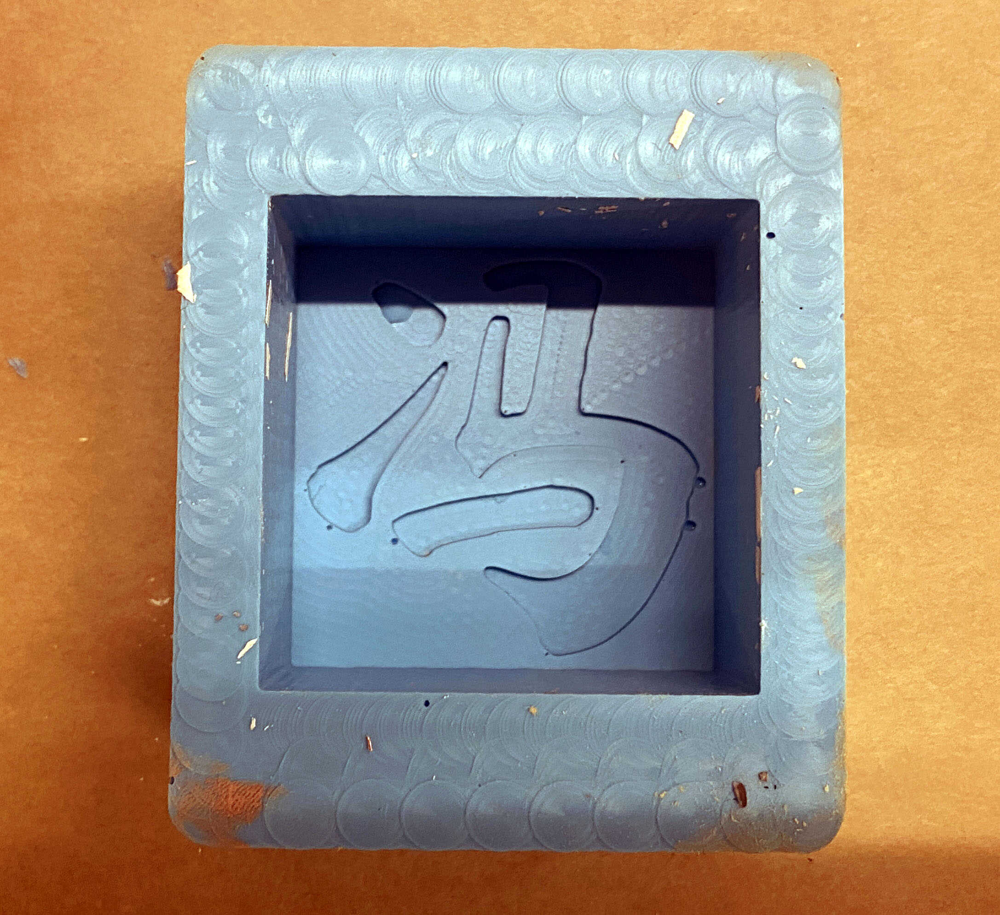

# week 7: molding and casting

## weekly log

### designing the mold
- i wanted to create a flower pot, similar to the [one]() made by [Alexandre Chappel](https://www.youtube.com/c/achappel)

- there were two issues with making the pot though
    1. the size of the wax block we were given
    2. the oomoo mold from the wax mold method
- i'm not positive, but i think that doing (2) its mostly amenable to convex shapes, not concave ones like a pot (it's possible with a two part mold, but the wax blocks we were given were not deep enough for a good planter)
    - i didn't really consider making a more complex mold (3 pieces or more), but doing so probably makes it possible
- in the end, i went with making a seal of my surname (family name), similar to 印章 (but much less complex)
    - i could have used the Othermill to create finer details but i weighed the amount of time it would take, and decided to just mill it on the Avid, and potentially make another at another time

- i learned that Fusion 360 handles text (at least non-ascii characters) in a rather odd way. first, it is only possble to scale text at a 1:1 aspect ratio; we can't squeeze text like we can in Illustrator. second, when scaling the text, the text simply becomes blurry, instead of a high resolution glyph.
    - we can turn the text into sketch features by exploding it, but there is also the interesting aspect that the text is then unmovable; i need to examine this further.

- taking inspiration from [Lingdong](http://fab.cba.mit.edu/classes/MAS.863/CBA/people/lingdong/site/), its possible to computationally generate seal designs from input characters; i think i will try that this week (week 8)

### making the mold

- as previously stated, the first mold was the wax one; milling it on the Avid was definitely the right choice, because the job time was under 5 minutes. the real bottleneck was the tool change.
    - i also realized at this point that i was only doing 2.5D cutting; i could extend the project by designing a crown for the seal as well

### casting oomoo

- luckily for me, casting the oomoo was pretty straightforward, and i didn't make a mess.
- it was fascinating watching the bubbles pop as i poured the oomoo into the mold as a thin (or flat) stream
- removing the oomoo from the wax was definitely the biggest challenge. using compressed air worked wonders, but nearing the end, where half of my mold was out but the other half stuck, i was pretty nervous that i might rip or tear the mold. luckily nothing of the sort happened though.

### casting drystone

- in one of the demos, Anthony casted a drystone Stormtrooper head mixed with &ldquo;flesh&rdquo; colored dye. the end result was actually more of a sandstone look, and i knew that was the design i wanted for my seal
- also, drystone with water is a really interested fluid. i was definitely afraid that the mixture was too viscuous when i was pouring it into the oomoo mold, but after it settled, it became very liquidy (like a non-Newtonian fluid). then i was afraid that it wasn't viscuous enough. it all worked out in the end though.

- the drystone had a lot of bubbles, and i got rid of many (particularly the large ones) by tapping the mold against the table repeatedly. the cast still ended up having small bubbles near the edges and corners, which in hindsight i probably could have handled by _coating the mold with a thin layer of drystone mix first_.
- i'm still happy with the result though; it could definitely be used as a seal, and i think its definitely a great first iteration. i would definitely like to try wet sanding the cast to make it look more polished, and perhaps seal it.

## files
- [cad for milling seal wax mold](/wk7/seal.f3d)