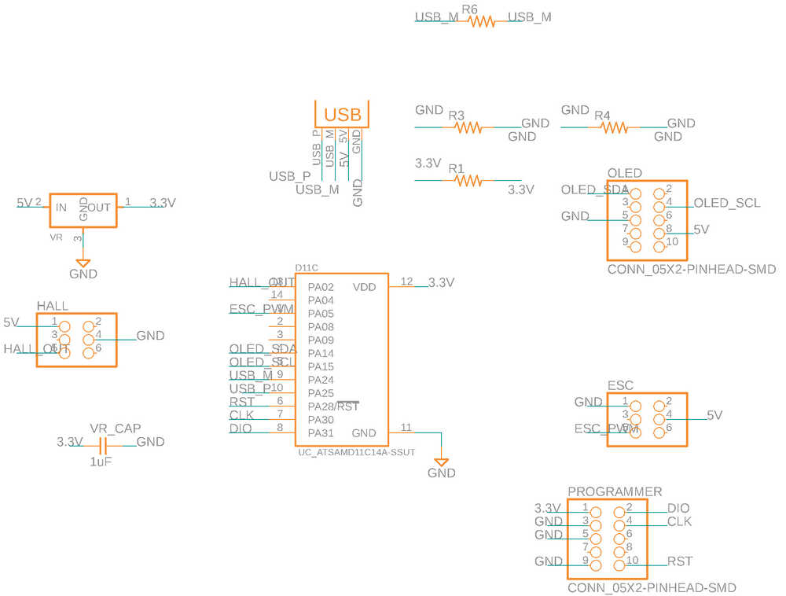
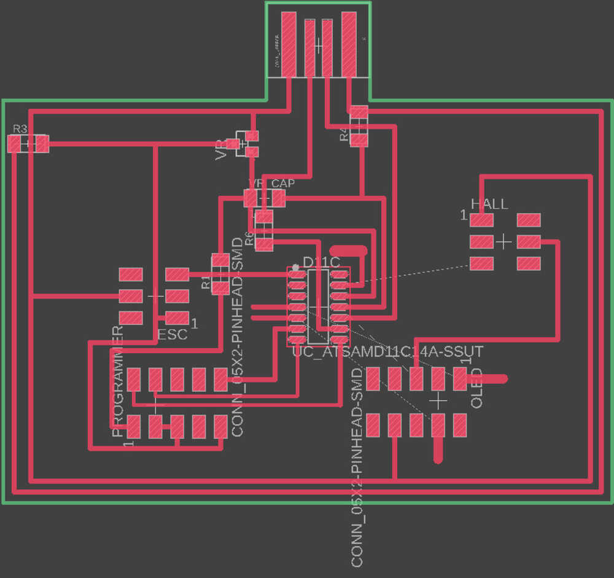

# week 9: output devices

- for this week, i decided to get a BLDC running with an ESC, since my final project would use that motor as the main part of the centrifuge

## build log

- designing the board was actually really simple, because the motor was powered through an external source (and thus not connected to the board)
- i only needed to add a header for the servo signal and a ground trace
- i learned how the servo protocol works: every 20 ms (aka 50 Hz), sending a 1ms pulse represents the lowest speed; sending a pulse of 2ms represents the maximum speed
    - this was implemented using Arduino's `delayMicroseconds` in order to get accurate timing
- i used thicker traces (20mil) milling the board because the Roland wasn't giving the best milled results, and the board i had milled with thinner traces started peeling

## final product

- the motor spins, and its speed can be controlled via the esc (sending commands via serial)!

  <video width="600" controls>
    <source src="../../videos/wk9/motor.mp4" type="video/mp4" />
    Your browser does not support the video tag.
  </video>

## files
- [arduino sketch for running the motor via an esc: esc.ino](/wk9/esc.ino)
