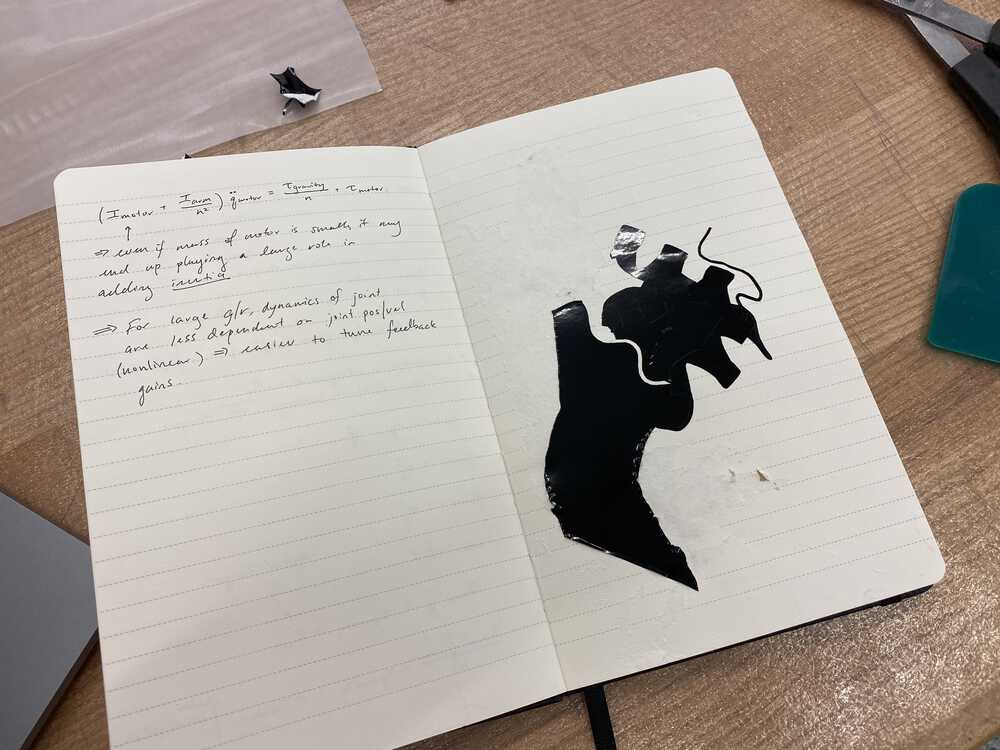
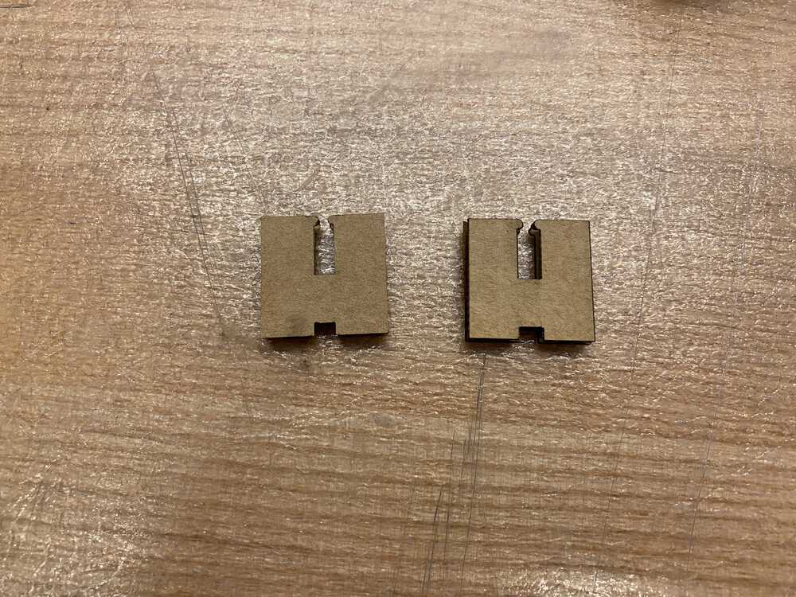
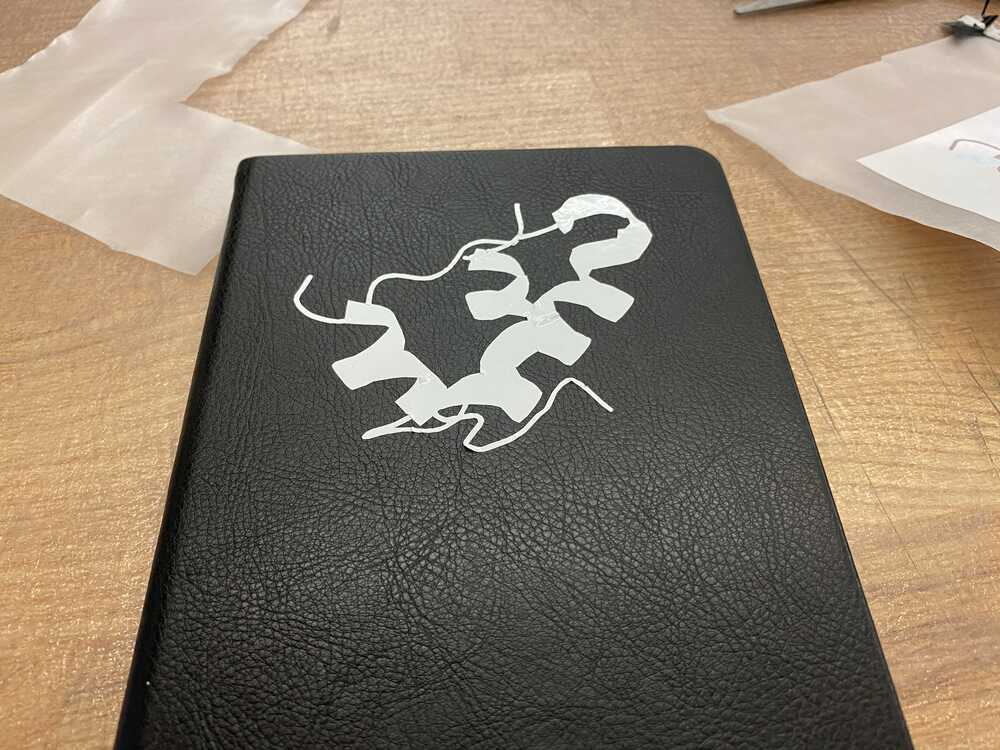
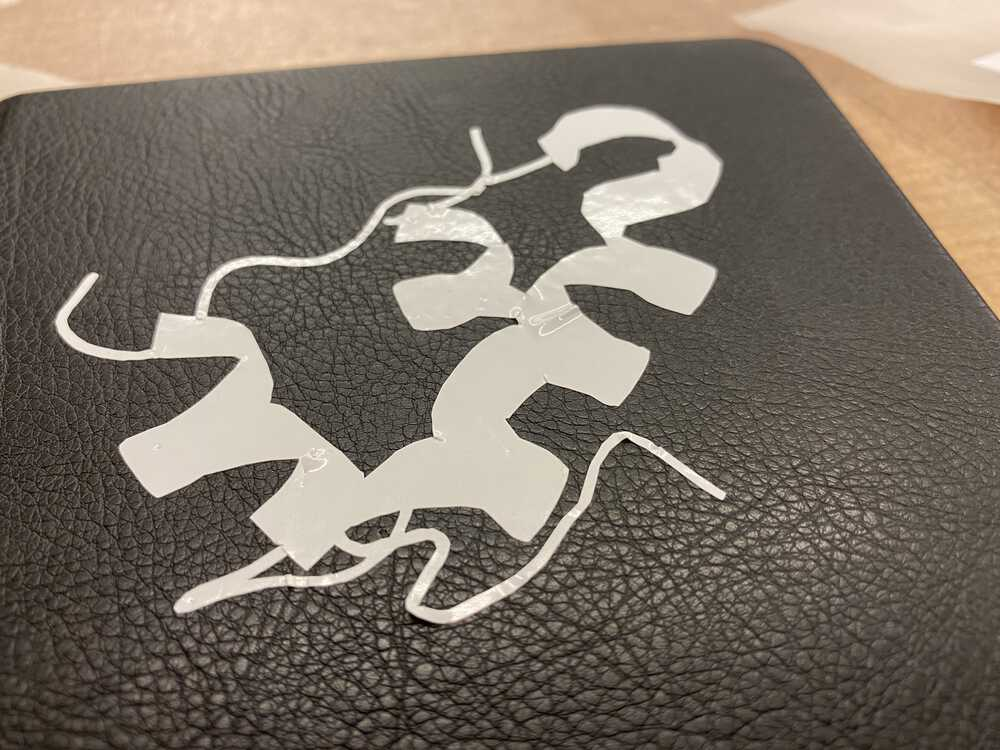
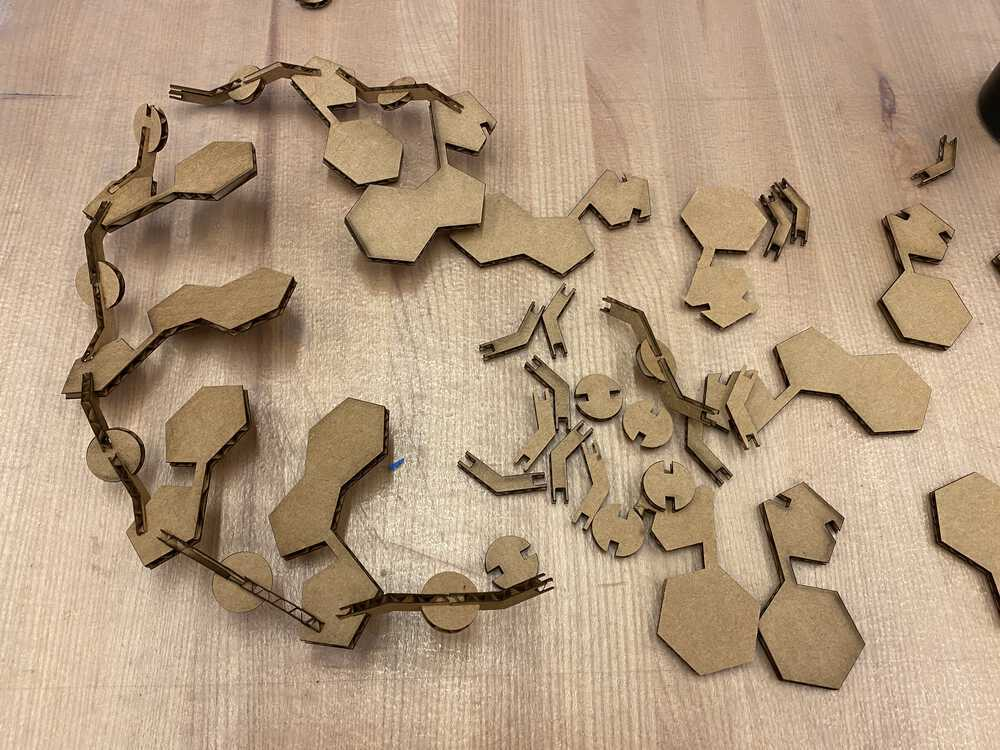

# week 1: computer controlled cutting, git

## things to remember

### [mods](https://mods.cba.mit.edu)
- **getting to the PNG cutting program.** right-click for menu, then select: `programs > open server program` and select `Roland / vinyl cutter / GX-24 / cut png` (the forward slash `/` indicates a tab in the programs listing).

### gatsby
- **`gatsby clean`**. after editing assets, always clean up the old, cached assets, otherwise things (e.g. image links)
- **`npm install gatsby-remark-copy-linked-files`**.
- **`gatsby build --prefix-paths`**. use the `pathPrefix` setting in `gatsby-config.js` which will allow custom URL prefixes (necessary for a shared class website like the one we are using in MAS.863)

### bash tricks
```bash
# compressing all my images at once
for f in $(ls); do convert $f -quality 50% -resize 1000 out/$f; done
```

### git
```bash
# list file sizes in current directory
find . -type f  -exec du -h '{}' + | sort -hr

# todo...
git ls-files --cached
```

### ffmpeg
```bash
ffmpeg -i 20_final_product.mov -vcodec libx264 -b:v 1000k -vf scale=-2:1080 -an 20_final_product.mp4
```

---

# weekly log

## 2021-09-19 &mdash; vinyl cutter and snap fit joint 

### vinyl cutter notes

#### using `mods` and the vinyl cutter
- **preparing your image.** want the background to be white; there is an invert function in `mods` that can help you do that
- **things that make your image hard to transfer.** the vinyl cutter can cut pretty much any shape. the problem comes when you want to stick that vinyl cut design onto some surface (the transfer). **small features, thin lines, and intersecting thin lines** are particularly painful (they tend to not stick to your desired surface, and/or tear when you are trying to peel back the transfer paper - see below). a trick is to use the tweezers to push the details down before lifting the transfer paper up.
- **sending your file to the printer.** see the button `waiting for file`? that means you need to press `calculate` in the `cut raster` panel

#### transfering your vinyl cut to your desired surface
- take the vinyl cut design from the cutter
  - the vinyl cut (vc) has two sides: side D is the side with the cut design; side B is the backing (the backing should not have been cut by the vinyl cutter)
- cut a piece of **transfer paper** (tp) that is larger than your design. the transfer paper has two sides: side S is the sticky side, and side T is the textured side.
- place the tp and vc together so that the four faces look like the following
  - `tpT - tpS | vcD | vcB`
  - note that tp is actually a single layer, which is why its two sides are separated with a dash rather than a pipe
- you can now remove vcB, which will expose the sticky back part of vcD
- stick the `(tpT - tpS | vcD)` onto your desired surface (ds); it will stick because of vcD's sticky back
  - the result is `tpT - tpS | vcD | ds`
- carefully attempt to remove tp; you may need to use tweezers here
  - don't use a ds like paper, because why you try to remove tp, you will tear the paper and the result will be sad



### cad notes
- red construction line = underconstrained
- black construction line = full constrained
- constraining to midpoint:
  - create midpoint (triangle symbol), then coincident to midpoint
- **avoid exporting your construction lines in dxf.** when exporting your sketch to DXF, to avoid the construction lines, you should extrude your sketch to a body, then select a face of that body, create a sketch from it, and export that sketch to a DXF.

### laser cutter notes
- snap fit joints aren't the most suitable for cardboard, because cardboard doesn't have the flexibility to stretch in order to place the two notches together. they are definitely stronger in preventing the cardboard from sliding back out, however.
- right side (18"x32" bed size) laser
  - 100% power, 10% speed, 1000 rate, 0.22 z-axis

### progress
- i cut some snapfit joints to practice both CAD and using the laser cutter; the snapfit model lets you parameterize the square size, notch size, and clip diameter.




- i also successfully vinyl cut the 2D projection of a protein (human insulin: [PDBID: 3I40](https://www.rcsb.org/structure/3i40)) and placed it onto my notebook
  - there is still some work to be done practicing the transfer process, especially with thin lines, but overall i am satisfied with this week






## 2021-09-20 &mdash; working on the press-fit construction kit

### general tricks
- **use github to transfer unsensitive files.** because the machines usually have internet access, it's easier to pull files down from github than to log in and log out every time you need a file

### laser cutting
- a 1.5 inch bond length is too large
- laser cutter bed is 32 inches by 18 inches
- a good next step would be to figure out how to assemble the pieces in CAD so I can picture the whole DNA molecule in the CAD drawing

### cad tricks
- constraining your CAD drawing is super important for parametric models, because if you don't and then try to change your parameters, the software will probably place your sketch in locations that don't maintain the relations (e.g. shapes, angles, and lengths) you want.
- probably a bad practice, but if you're in a time crunch and want to constrain your CAD drawing, you can fix certain lines to the canvas; this is useful if you fix construction lines that define the origin of each component, so that the component doesn't translate when resized
- **getting angles correct.** because I wanted my DNA to require 10 bases every turn, I had to ensure that the angle between base pairs was 144 degrees (which would form a 10-sided polygon).
- the final challenge was figuring out how to get the model to stand

### progress
- i realized that my model isn't able to stand on its own, because it doesn't have any legs to use to support itself; i'm going to need to design something tomorrow



## 2021-09-21 &mdash; trying to make my RNA model structurally sound

### progress
- i CADed a couple of models for the legs to support the DNA model
- i also decided to make an RNA model rather than DNA model (double helix); (this note is after-the-fact: the double helix should be possible because the legs supporting the model can be used to support both chains).
- here I am using the laser cutter to cut the final model of the legs

<video width="600" controls>
  <source src="../videos/wk1/14_laser_cutting.mp4" type="video/mp4" />
  Your browser does not support the video tag.
</video>

- the legs were still unstable because they need to be lifted at the same time, but with two hands that is impossible, so...
- i had to hot-glue the legs to a cardboard base because i wasn't sure how to make press-fit joints that would sit flush on the base

### the final product!

<video width="600" controls>
  <source src="../videos/wk1/20_final_product.mp4" type="video/mp4" />
  Your browser does not support the video tag.
</video>

## 2021-09-22 &mdash; making my website

### progress
- using [Gatsby](https://www.gatsbyjs.com/) because programming websites in React makes making cool stuff a lot easier.
